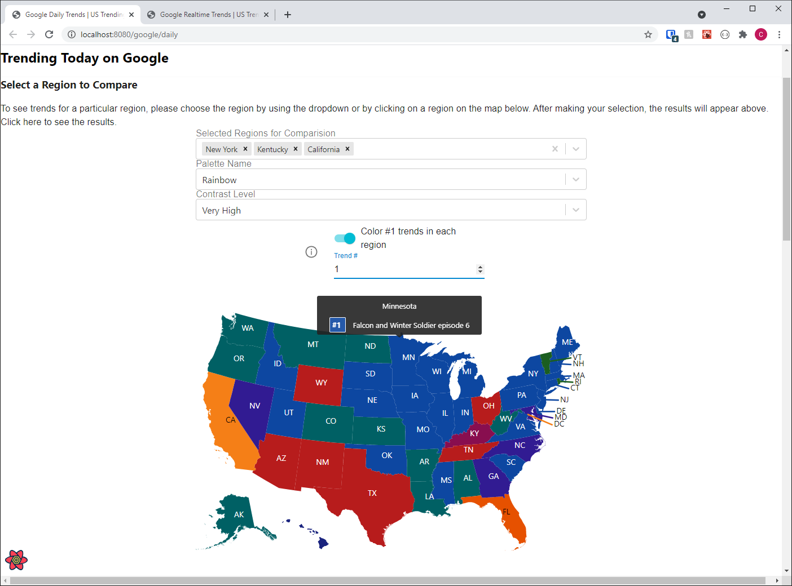

# Purpose

The purpose of this app is to visualize trending Google Searches by US State
using several different angles.

Table of Contents

- [Purpose](#purpose)
- [Development Documentation](#development-documentation)
- [About the Project](#about-the-project)
  - [The Project Goals](#the-project-goals)
  - [The Product Goals](#the-product-goals)
  - [Google Trends](#google-trends)
  - [Twitter Trends (Deprecated)](#twitter-trends-deprecated)
- [System Design](#system-design)
- [Features](#features)
- [Routes and Endpoints](#routes-and-endpoints)
- [Demo (In Place)](#demo-in-place)
  - [Trending Nearby](#trending-nearby)
  - [Google Daily / Realtime Trends](#google-daily--realtime-trends)
- [Production Documentation](#production-documentation)

# Development Documentation

If you are wanting to test this project in development, and have been given
explicit permission to run the code, please see the
[development documentation](docs/development.md).

# About the Project

## The Project Goals

This project was designed for the following purposes. The actual product idea
(visualization of trends data) did not come until later.

- Learn about `Golang`
  - I wanted to use a fast, modern language to be able to process things
    quickly. I prototyped the back-end and worker scripts in `Node.js` since that
    was what I was used to, but I was disappointed with how slow it was at
    fetching and processing my data. I took this opportunity to learn about
    `golang`. After implementing a concurrent means of getting my data
    (the most time-consuming part), I ultimately decided that I needed to
    rate-limit these outgoing requests due to concerns on how this design would
    impact the 3rd parties based on their rate-limit policies
- Learn about `Next.JS`
  - During the prototyping phase, I was also using `React.js` via
    `Create-React-App`. I learned that SEO optimization was not well implemented
    out-of-box, so I decided to take this opportunity to learn about Next.JS
    I wanted to ensure that in production, this project could be found via
    search engines
- Do more work with `kubernetes`, `docker`, and deploying into production with
  a `CI/CD` Pipeline
  - I have been working with kubernetes and docker for some time with my
    passion projects, and I've been enjoying the developer experience that they
    offer
  - Since discovering `docker-compose` and `kubernetes`, I've been obsessed
    with perfecting the developer onboarding experience. I wanted this experience
    to prepare me for developing with a team in the future
- Integrate multiple services
  - I wanted to design something that relied on a delta interval to fetch and
    process data, as well as having multiple services inter-communicate
  - While this project does not leverage any form of authentication or
    authorization, it was fun to work on more than API at a time
  - The Public API would serve the web front-end
  - The Private API would serve the worker, which both would manage data
    processing in some fashion. The Private API would centralize any 3rd party
    service calls, and the worker would execute these and process any data on a
    specified interval

## The Product Goals

I wanted to keep the implementation details simple. I figured finding and
visualizing a simple dataset would suffice for this project. I wasn't setting
out to solve any problems in particular. This led me to looking for datasets
for:

1. Google Trends
2. Twitter Trends

## Google Trends

I figured that it would be cool to see
**what is trending in your US state, or the states around you**. There wasn't
really a means of seeing **what was trending #1 on google for each state** on
Google Trends' website. There was, however,
**a means of seeing how popular a trend is in each state**. This would be key
in manifesting this project.

I also wanted to make this app as informational as possible. That is, while you
can see what is trending, you could also see news related to these trends. All
of this would be provided by the APIs in use, so I wouldn't have to supplement
this data myself.

Since I wanted to have a means of displaying what is "trending nearby", this
introduced the need for a database that supported `geolocation queries`.
While you could get the same information from this product via the visualization
pages, I figured this view would be more user-friendly for people who want to
simply view what is trending nearby without being overwhelmed with all of the
graphics and other data.

With this dataset meeting my criteria of being pretty simple, I prototyped my
applications to use this dataset and was satisfied. At this point, I was able
to complete my initial goal for the product.

Once this prototype was complete, I moved on to Twitter Trends.

## Twitter Trends (Deprecated)

I wanted to do the same thing for Twitter, alongside some additional ideas.
I wanted live-stream tweets related to the top trends, specific categories
(entertainment/politics/etc.). This was a perfect use case for my split API
back-end: I could scale up the Public API both horizontally and vertically.
The Private API should only need to be scaled up vertically, since it only
serves the worker service.

After then pursuing the same manner for the Twitter Trends, I learned that
**Twitter did not have a means of tying trends to a specific state**, but
rather, **a specific set of cities across the US**. I did not like the idea of
letting a handful of cities represent an entire state in the map visualization
(since I only cared about the popularity of trends at the state level, not the
city level). Not to mention, Twitter did not have trend data for all US states
(only about 26 of them). While I could create a separate map containing each
city and colorizing pins on those cities based on their trends (similarly to I
did the Google Trends), there were some new challenges that arose:

1. For Google Trends, I could use the daily/realtime country-wide trends as the
   static set of trends, which means that each region would always have the exact
   same set of trends. Ergo, I could ensure that each trend got a specific color
   (based on its trending rank country-wide)
2. For the Twitter Trends, it was entirely possible that what was trending
   country-wide did not match the set of trends trending for a specific city.
   That is, every city could have a disjointed set of trends

Since the propensity was high for each region's datasets to be different, it
warranted a new approach compared to how the Google Trends were displayed.
Since I ultimately set out to learn about new technology, I decided not to
pursue the implementation of Twitter Trends in this project `on the front-end`.
The Streaming API would also not be implemented; however, the back-end endpoints
for fetching trends have been.

Now that Twitter was out of the picture, I didn't have a real reason why the
back-end should be split between a Public/Private API anymore. The purpose of
doing that was to ensure that I could scale them differently based on how they
were used (read vs write/streaming operations). They could be merged, and the
end-product would be the same.

However, I elected to leave this architecture in place, as there is a
possibility that I could come back and implement the Twitter Trends and its
Streaming API as described above. But since my primary goal has been reached
just by using the Google Trends dataset, this will suffice for now.

# System Design

Attached below are some graphics of the system design behind this application.

In the above graphic, you will see how the two APIs interact
with the data stores, as well as how the web client fetches the and renders it
for the end-user. This design allows me to scale the Web Client, Public API,
MongoDB, and Redis both horizontally and vertically. This is, at a very high
level, how the system will interact.

Since the Private API and the Worker are only used on the back-end to populate
the data stoures, they only need to scale vertically (if at all). As mentioned
earlier, this design with the Private API would allow me to provision resources
should it ever implement resource intensive processing (Twitter Stream API),
but that was out of scope for this project.

Below, you can see what the system would actually look like in the
kubernetes cluster provided by this repo for the local development environment.

The thoughts on the production system design:

- I would not deploy MongoDB service in the kubernetes cluster
- I am still debateing whether or not I would want to deploy the Redis service
  in the cluster. I may consider using `Bitnami's Redis Operator Helm Chart` to
  make the Redis instance more scalable. I've entertained this because it seems
  that `Google Cloud Platform's Memstore` doesn't seem to be able to scale
  horizontally
- Everything else would likely be deployed in the kubernetes cluster

# Features

Below is a list of primary features that are either completed or a
work-in-progress.

- [x] Front-end (web client)
  - [x] Display Nearby Google Trends
    - [x] Display Google Daily trends for the country
    - [x] Display Google Daily trends for the state nearest you
    - [x] Display Google Realtime trends for the country
    - [x] Display Google Realtime trends for the state nearest you
  - [x] Display Google Daily Trends (Country and Region Overview)
    - [x] Display USA, colored by #1 trend per state
    - [x] Display USA, colored heatmap for a specific trend
    - [x] Implement means of changing color palette
    - [x] Implement means of comparing trends for a given state
    - [x] Implement means of displaying trending articles for a clicked trend
    - [x] Implement means of changing # of trends displayed
    - [x] Implement grid view of trends per state
  - [x] Display Google Realtime Trends (Country and Region Overview)
    - [x] Display USA, colored by #1 trend per state
    - [x] Display USA, colored heatmap for a specific trend
    - [x] Implement means of changing color palette
    - [x] Implement means of comparing trends for a given state
    - [x] Implement means of displaying trending articles for a clicked trend
    - [x] Implement means of changing # of trends displayed
    - [x] Implement grid view of trends per state
  - ~~[ ] Display Twitter Trends (Country and Region Overview)~~
- [x] Back-end

  - [x] Database
    - [x] Populate database with Zipcodes containing geolocation data from US
          Census
  - [x] Database for Caching Layer (Redis)
  - [x] Private API (Trends API)
    > Note: This is used by only the worker service
    - [x] Fetch Google Daily Trends
    - [x] Fetch Realtime Daily Trends
    - [x] Fetch a trend's popularity by region (US State)
    - [x] Implement cache layer for storing Google Trends responses
    - [x] Implement cache layer for storing the completed/processed data from
          Google Trends
    - [x] Implement cache proxy keys that will prevent the replacing of the
          completed/processed Google Trends data until the these key expires (one for
          each the completed dataset for daily/realtime trends). This will ensure that
          processed trends data always exists in the redis cache (does not expire)
  - [x] Worker Script
    - [x] On a delta interval, using the Private API
      - [x] Process Google Trends
        - [x] Get all Google Daily / Realtime Trends for the US
        - [x] Queue those for processing
        - [x] Process them by fetching the trend's regional popularity (by US
              state) where each state has a list of its trends sorted by popularity
        - [x] Cache for use by the Public API
      - [x] Process Twitter Trends (Deprecated)
        - [x] Get Twitter Trends for all US Twitter Places
        - [x] Cache for use by the Public API
  - [x] Public API

    > Note: This is used by the front-end web client
    >
    > There is a caching layer to make subsequent reads faster from the MongoDB
    > database. The worker itself caches any of the trends data that the Public
    > API is interested in.

    - [x] Implement route for fetching processed Google Daily Trends for each
          all US states
    - [x] Implement route for fetching processed Google Realtime Trends for each
          all US states
    - [x] Implement route for fetching zipcodes by:
      - [x] Zipcode
      - [x] Nearest point
    - [x] Implement route for fetching a Twitter Place
      - [x] Zipcode
      - [x] Nearest Point
    - [x] Implement route for fetching all processed Twitter Trends for
      - [x] All US Twitter Places
      - [x] A specific Twitter Place

# Routes and Endpoints

Since I am not using any API documenting utility, I have provided the routes
for my APIs below. These are all HTTP GET requests, since all of the data is
sourced from a 3rd party. Any data that is written to the database or cache
layer is done either after a successful GET request from the 3rd party API, or
done by the worker service after processing the data sourced from the 3rd party.

1. Public API
   1. [/api/google/trends/daily](http://localhost:8080/api/google/trends/daily)
      1. Returns today's google trends (as cached by worker)
   2. [/api/google/trends/daily/states](http://localhost:8080/api/google/trends/daily/states)
      1. Returns the processed trends data for all US states (as cached by worker)
   3. [/api/google/trends/realtime](http://localhost:8080/api/google/trends/realtime)
      1. Returns what is trending on google at this moment (as cached by worker)
   4. [/api/google/trends/realtime/states](http://localhost:8080/api/google/trends/realtime/states)
      1. Returns the processed realtime trends data for all US states (as cached by worker)
   5. [/api/zipcodes/nearest/point?long=-73.99653&lat=40.750742](http://localhost:8080/api/zipcodes/nearest/point?long=-73.99653&lat=40.750742)
      1. Returns a Zipcode (US Census) closest to this point
   6. [/api/zipcodes/{zipcode:[0-9]{5}}](http://localhost:8080/api/zipcodes/10001)
      1. Returns a Zipcode (US Census)
   7. Deprecated Endpoints
      1. [/api/places](http://localhost:8080/api/places)
         1. Returns all Twitter Places
      2. [/api/places/{countryCode:[a-zA-Z]+}](http://localhost:8080/api/places/US)
         1. Returns all US Twitter Places
      3. [/api/places/nearest/point?long=-73.99653&lat=40.750742](http://localhost:8080/api/places/nearest/point?long=-73.99653&lat=40.750742)
      4. Returns a Twitter Place closest to this point
      5. [/api/places/nearest/{zipcode:[0-9]{5}}](http://localhost:8080/api/places/nearest/10001)
         1. Returns a Twitter Place closest to this Zipcode
      6. [/api/twitter/trends](http://localhost:8080/api/twitter/trends)
         1. Returns all twitter trends (for all US Twitter Places, as configured and cached by worker)
      7. [/api/twitter/trends/{woeid:[0-9]+}](http://localhost:8080/api/twitter/trends/1)
         1. Returns an individual trends list for a given Twitter Place (for individual US Twitter Places, as configured and cached by worker)
2. Private API (Trends API)

> NOTE: these endpoints are exposed to your kubernetes node's host in
> development (for ease of access). They will not be exposed in production.
> Otherwise, are only available from within the cluster. All pods will be able
> to query these using the IP Cluster Service for the `trends-api` Deployment.

1.  [/trends-api/google/trends/interest](http://localhost:8080/trends-api/google/trends/interest?keyword=Mortal%20Kombat&loc=US&timePeriod=now-1&lang=EN)
    1. Returns the geo widget containing regional trend interest for a given trend
2.  [/trends-api/google/trends/daily](http://localhost:8080/trends-api/google/trends/daily)
    1. Returns and caches today's google trends
3.  [/trends-api/google/trends/daily/states](http://localhost:8080/trends-api/google/trends/daily/states)
    1. Returns the processed trends data for all US states (as cached by worker)
4.  [/trends-api/google/trends/realtime](http://localhost:8080/trends-api/google/trends/realtime)
    1. Returns and caches today's realtime google trends
5.  [/trends-api/google/trends/realtime/states](http://localhost:8080/trends-api/google/trends/realtime/states)
    1. Returns the processed trends data for all US states (as cached by worker)
6.  Deprecated Endpoints
    1.  [/trends-api/places](http://localhost:8080/trends-api/places)
        1. Returns All Twitter Places
    2.  [/trends-api/places/{countryCode:[a-zA-Z]+}](http://localhost:8080/trends-api/places/US)
        1. Returns Twitter Places for a given country
    3.  [/trends-api/twitter/trends/{woeid:[0-9]+}](http://localhost:8080/trends-api/twitter/trends/1)
        1. Returns a specific Twitter Place

# Demo (In Place)

Since this project is not production-ready yet, I will demo the overall features
below in place. As described in the [Features](#features) section, there are a
handful of things to be done before I want to take this into production.

> Know that the development environment uses `skaffold`, which leverages a local
> installation of `kubernetes`, so that transferring this project into a
> production kubernetes cluster will be rather seemless.

With that being said, let's demo the product.

> Note: The user interface design is not final at this time

## Trending Nearby

This would likely be the landing page for the application. You can enter a
`zipcode` or use your `browser location` to see what is trending in your state
today (compared to what is trending country-wide).

## Google Daily / Realtime Trends

> Note: the Google Daily and Realtime Trends pages look the same, but the trends
> dataset is different.

On this page, you would be able to see a data visualization of what is trending
across the US. The different modes are:

1. The Default Map View

   This shows you which country-wide trend is trending #1 across the US. The
   country-wide trends are displayed lower on the page (in a later example).
   You can also control which trending rank is highlighted. For example, if you
   want to visualize which country-wide trend is trending #2 for each state,
   you can do that.

   

   Here you can see that #1 in Minnesota is
   `Falcon and the Winter Soldier Episode 6`, which is also the case for the
   other states highlighted with the same color.

2. The Heatmap View

   This shows you how popular a given trend is. The end-user has control over
   which trend is being scrutinized. They can also control the color palette,
   which will propagate across the entire page upon changing.

   

   Here, you can see how popular the country-wide trend
   `Falcon and the Winter Soldier Epsiode 6` is. This specific trend is actually
   ranked #7 in the US for Today's trends on Google. You can verify that in the
   comparison view in the next example.

3. The Region (State) Comparison View

   Upon clicking on a US State on the map, or via the select dropdown above the
   map, you can compare trends between the US as a whole and each individual
   state. The country-wide trends will always appear first in this list.
   Hovering over a trend will highlight its position in other states (see that
   the #2 country-wide trend is actually trending #10 out of the states being
   compared).

   By default, the app will only render the top 10 trends. Sometimes there will
   be more than 10, in which case you can use the slider to render more.

   

4. Related News Articles for a Given Trend

   Upon clicking on a trend, the related articles that Google Trends has
   associated for the selected trend will be displayed in a modal, along with a
   link to this trend's statistics on the actual Google Trends website.

   

5. Grid View

   This section of the page will provide a filterable and sortable table view
   containing all of the US states and their respective trends. This is provided
   so you can easily filter which states might have a specific trend at a
   specific rank.

   

   You can click on a trend here to display the article modal as well.

# Production Documentation

See: [production documentation](docs/production.md).
